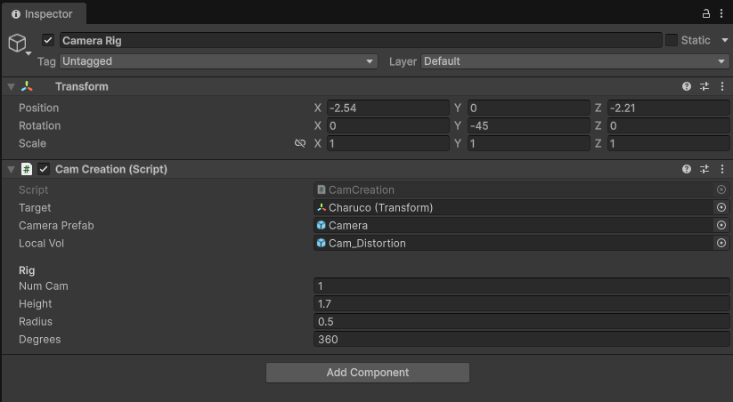

# Camera Creation

**Object:** Camera Rig  
**Script:** `CamCreation`

## Goal
Create a set of cameras uniformly distributed around a target object.

## Execution
In Scene Mode, press **Build Rig** in the component.

## Parameters
- **Target** — Object around which cameras are distributed
- **Camera Prefab** — Prefab containing camera configuration
- **Local Volume** — Adds distortion effects
- **Num Cam** — Number of cameras to create
- **Height** — Vertical offset
- **Radius** — Distance from target
- **Degrees** — Angular distribution range
