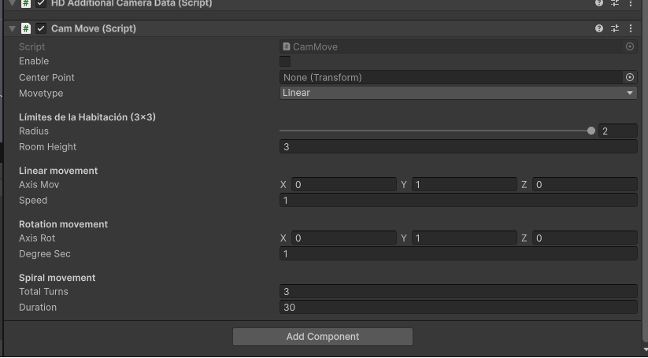

# Camera Movement

**Status:** Functional but under refinement.  
**Object:** `Cam_XX`  
**Script:** `CamMove`

## Goal
Add movement to the cameras created in the rig.

## Execution
Starts automatically in Play Mode.

## Parameters
- **Enable** — Activates movement
- **Center Point** — Movement reference object
- **Move Type** — `Linear` / `Round` / `Spiral`

## Notes
- Linear and Round movements may exit room bounds.
- Spiral remains within defined room limits.
