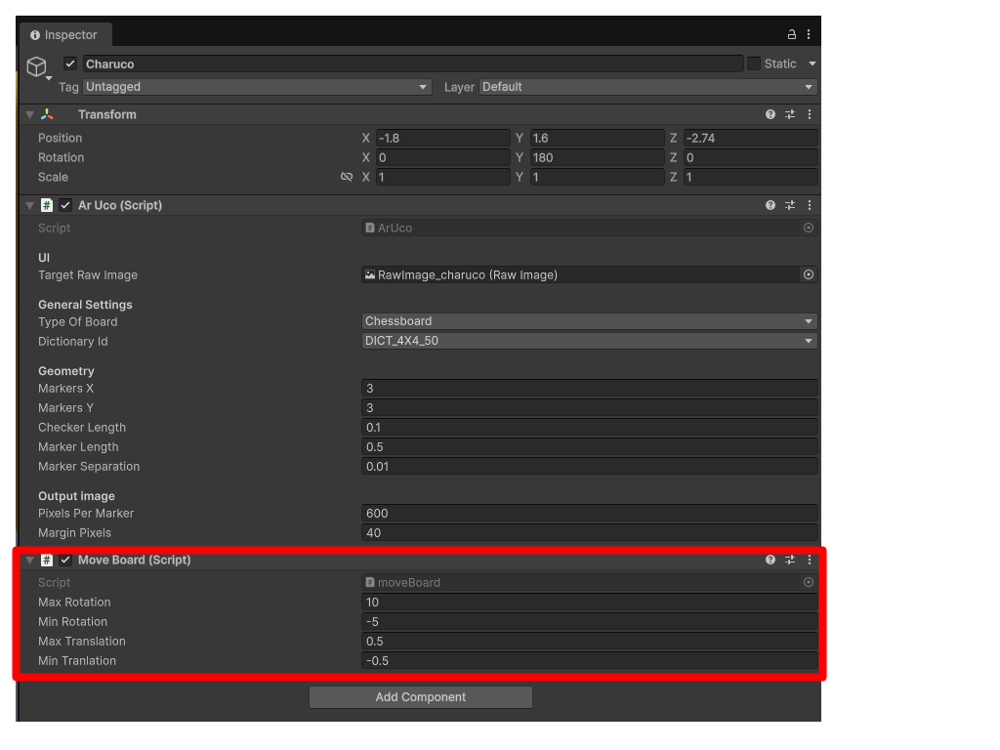

# CharUco Board Movement

**Object:** Charuco  
**Script:** `moveBoard`

## Goal
Apply controlled random movement to the board.

## Execution
In Play Mode, press **R**.

## Parameters
These parameters limit movement in the scene:
- **Max / Min Rotation**
- **Max / Min Translation**
