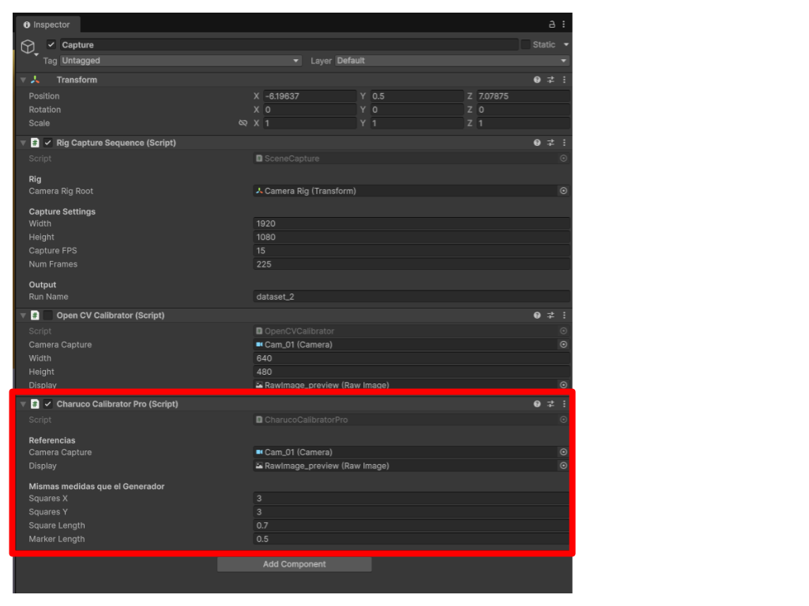

# Detection and Calibration

**Object:** Capture  
**Script:** `CharucoCalibrationPro`

## Goal
Detect board corners and markers to compute intrinsic and extrinsic matrices.

## Execution
- Press **Space** to capture a frame
- Press **C** to calibrate

## Parameters
- **Camera Capture** — Camera to calibrate
- **Display** — Raw Image for detection preview
- **Squares X / Y** — Must match the board configuration
- **Square Length** — Must match the board
- **Marker Length** — Must match the board
- **Dictionary** — Currently hardcoded and should become a parameter

## Visibility
Current tested visibility range: **0% to 100%**.
