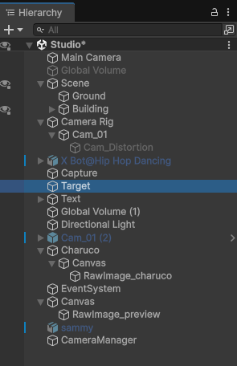

# Hierarchy Overview

## Main Camera
Captures a preview of corner detection. It is located outside the building since a camera cannot capture and display simultaneously.

## Scene
Includes the building, ground, interior lights, and other environmental components.

## Camera Rig
Parent object containing all cameras generated by script.

## Cam_01..0x
Cameras automatically created by the rig script. Each includes a local volume for distortion effects, currently disabled.

## Capture
Contains scripts for dataset capture and board detection.

## Target
Empty `GameObject` used as the center point for camera distribution.

## Text
Time validation.

## Charuco
Contains the script that generates the CharUco board texture. The generated texture must be assigned to `RawImage_charuco`.

## RawImage_preview
Displays corner detection preview.
